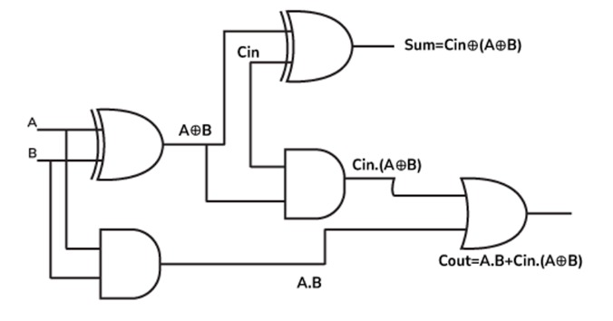
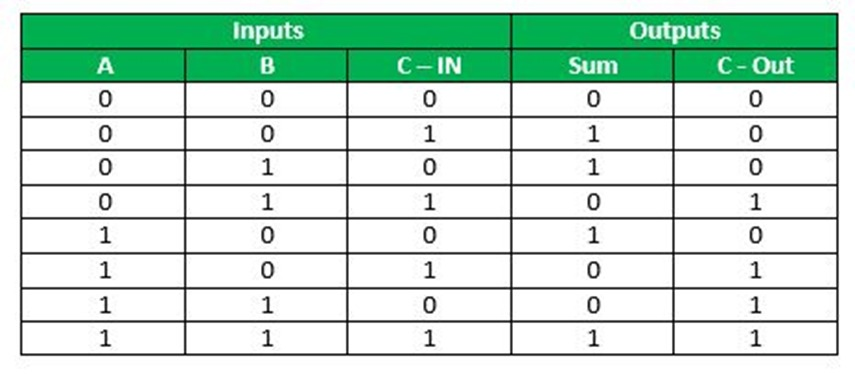
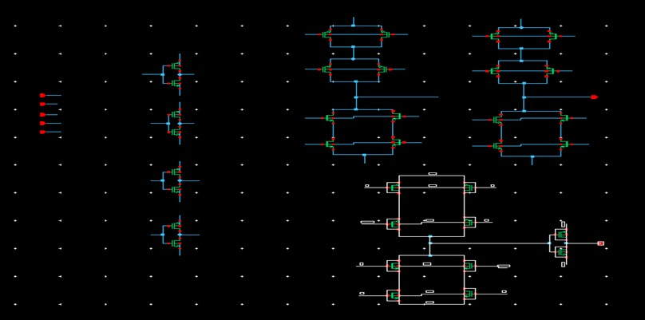
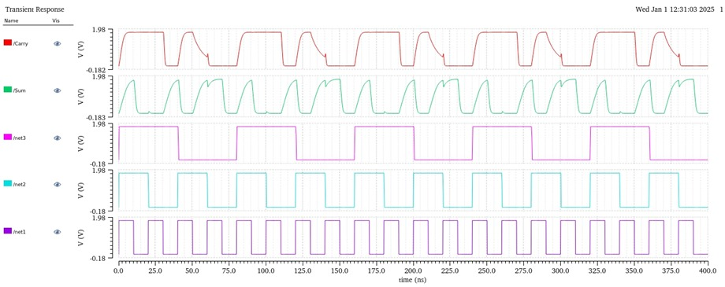
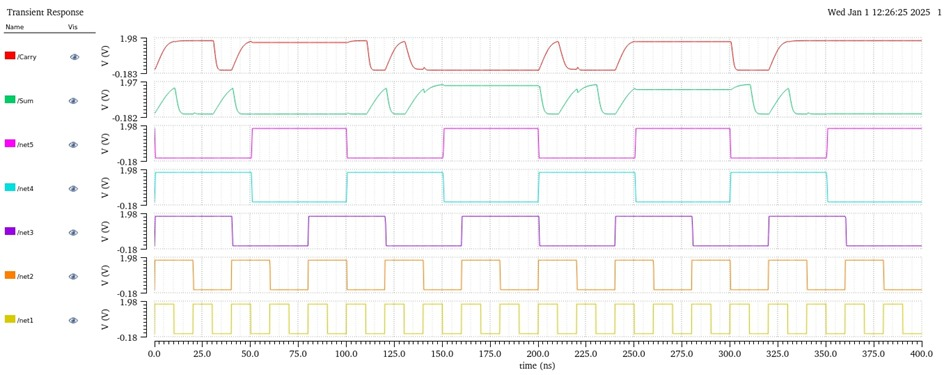

# CMOS-and-Clocked-CMOS-for-Full-Adder
Design and analysis of CMOS and Clocked CMOS logic for implementing a full adder. Includes transistor-level design, simulation, and performance comparison to evaluate power, delay, and area efficiency for digital circuit applications.

## Full Adder
A *Full Adder* is a fundamental combinational digital circuit used in arithmetic and logic operations. It performs the binary addition of *three input bits* — two significant bits (*A* and *B) and a **carry-in (Cin)* from a previous stage — and generates two outputs: the *Sum* and the *Carry*.  

The *Sum output* represents the least significant bit (LSB) of the addition, while the *Carry output* indicates the overflow that must be added to the next higher bit in multi-bit binary addition. Full Adders are the building blocks for complex arithmetic circuits such as *ripple-carry adders, **carry-lookahead adders, and **arithmetic logic units (ALUs)* used in microprocessors and digital systems.  

In hardware design, Full Adders are commonly implemented using *logic gates* or *transistor-level designs* like CMOS or Clocked CMOS logic. These implementations allow precise control over *power consumption, speed, and area, making the Full Adder an essential component in **VLSI and embedded system design*.
### Circuit diagram of Full Adder

  

### Truth Table of Full Adder

  

This project implements the Full Adder using two approaches:

- *Fully CMOS Logic Network* – Implements the logic using static CMOS design for stable performance.  
- *Clocked CMOS Logic Network* – Utilizes clocked transistors to optimize performance for specific applications.  

## Features
- Design and simulation of the *circuit diagram* and *truth table*.  
- *Performance analysis* of power consumption and propagation delay.  
- Validation of the design with simulation outputs. 

## Methodology: Full Adder Design in Cadence Virtuoso

This guide explains the step-by-step procedure to design and analyze a *Full Adder* using *Fully CMOS* and *Clocked CMOS logic* in *Cadence Virtuoso*.

---

### 1️⃣ Start the Cadence Environment
Open the Terminal
bash
tcsh

### 2️⃣ Source the Cadence Environment
bash
source cshrc

### 3️⃣ Open Virstuoso
bash
virtuoso &

# Creating a Full Adder Design in Cadence Virtuoso (UMC_180nm)

Follow these steps to create your *own library, build the schematic, and prepare for simulation in **Cadence Virtuoso*.

---

## Create a New Library
- Open Virtuoso CIW.  
- Go to: File → New → Library  
- Enter:  
  - *Library Name*: FULL_ADDER_CMOS  
- Select:  
  - *Attach to an existing technology library*  
  - Choose *UMC_180nm*  
- Click *OK*.  
✅ Your custom library is now linked to the UMC 180nm technology.

---

## Create a Cell View
- Go to: File → New → Cell View  
- Fill in the details:  
  - *Library*: FULL_ADDER_CMOS  
  - *Cell Name*: full_adder_schematic  
  - *View Name*: schematic  
  - *Tool*: Schematic Editor  
- Click *OK* to open the schematic editor.

---

## Place PMOS and NMOS Devices
- Open the *Add Instance* dialog:  
  - Shortcut: Press *i*  
- From the *UMC_180nm PDK library*:  
  - Select *PMOS* for p-channel transistors.  
  - Select *NMOS* for n-channel transistors.  
- Place the devices as per your *Full Adder design*:  
  - Build XOR, AND, and OR gates.  
  - Connect:  
    - *VDD* to PMOS sources.  
    - *GND* to NMOS sources.  
    - Input/Output pins for A, B, Cin, Sum, and Carry.

---

## Save and Check
- Save the schematic: *Ctrl + S*  
- Go to: Design → Check and Save  
- Ensure there are *no errors or warnings*.

---

Similarly create for the Clocked CMOS Logic.
## Simulation Using ADE L
- Open *ADE L* (Analog Design Environment - L) from Virtuoso.  
- Load the *schematic cell view* for either:
  - full_adder_cmos
  - full_adder_clocked_cmos
- Set the *VDD* source to *1.8 V*.  
- Go to Analysis → Choose and select:
  - *Type*: Transient (tran)  
  - *Run Time*: 100 ns
- Apply input stimulus signals (e.g., vpulse sources for A, B, Cin, and clock in the clocked design).  
- Run the simulation and observe the waveforms for:
  - Sum
  - Carry

---
## Fully CMOS Logic

The schematic of the *Fully CMOS-based Full Adder* is shown below, where the circuit is implemented using static CMOS logic gates such as XOR, AND, and OR to achieve the desired sum and carry outputs.

  

The simulation results for the *Fully CMOS design* are provided below, clearly demonstrating the correct generation of sum and carry signals for all possible input combinations, validating the functional correctness of the design.

  

## Clocked CMOS Logic

The *Clocked CMOS Full Adder* schematic is implemented in Cadence Virtuoso using the UMC 180nm technology library. This design incorporates a clock input to optimize the operation of the circuit and improve performance in specific applications. The schematic diagram is shown below:

  

The corresponding *output simulation* demonstrates the correct operation of the Clocked CMOS Full Adder for all possible input conditions, as illustrated below:

  

## Performance Comparison

| Design Style   | Sum Power | Sum Delay | Carry Power | Carry Delay |
|----------------|-----------|-----------|-------------|-------------|
| *Fully CMOS* | 821.5 mW | 2.717 ns  | 944.4 mW    | 1.469 ns    |
| *Clocked CMOS* | 779.9 mW | 3.634 ns  | 1.025 W     | 2.600 ns    |

---

## Observation

- The *Fully CMOS design* provides *lower delay* for both Sum and Carry outputs, making it highly suitable for applications that demand *high speed* and *low propagation delay*.  
- The *Clocked CMOS design* consumes *slightly less power* for the Sum output but results in *higher delays* and *increased Carry power*, making it less efficient for speed-critical circuits.  
- In terms of overall *power-delay product (PDP)*, the Fully CMOS implementation achieves a better balance between performance and efficiency.  
- Clocked CMOS may still be preferred in *low-frequency or power-sensitive environments*, but its slower speed limits its usability in high-speed arithmetic logic units (ALUs).

*Conclusion:*  
The *Fully CMOS Full Adder* is the *better choice* for most applications, particularly those requiring *fast response times* and *balanced power efficiency, while the **Clocked CMOS design* is suitable only for scenarios where *power saving is more critical than speed*.
